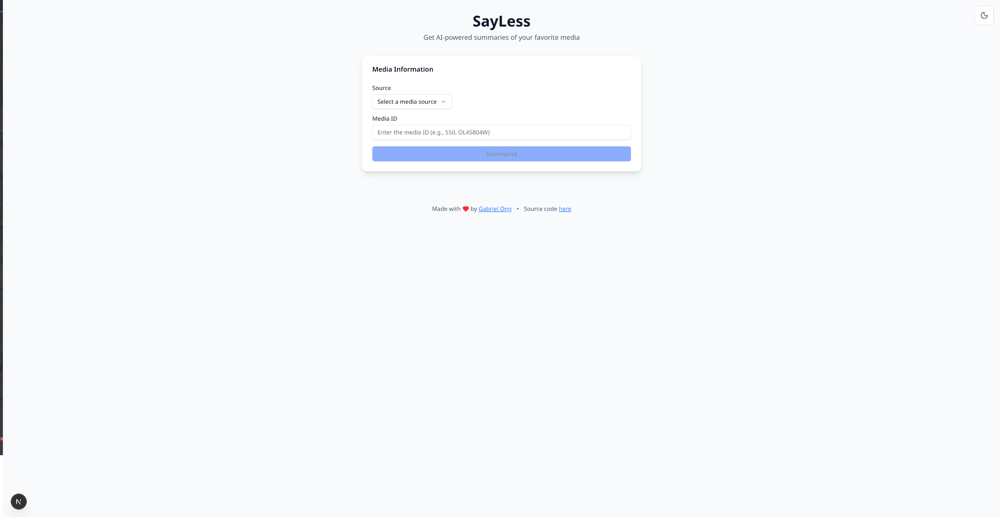
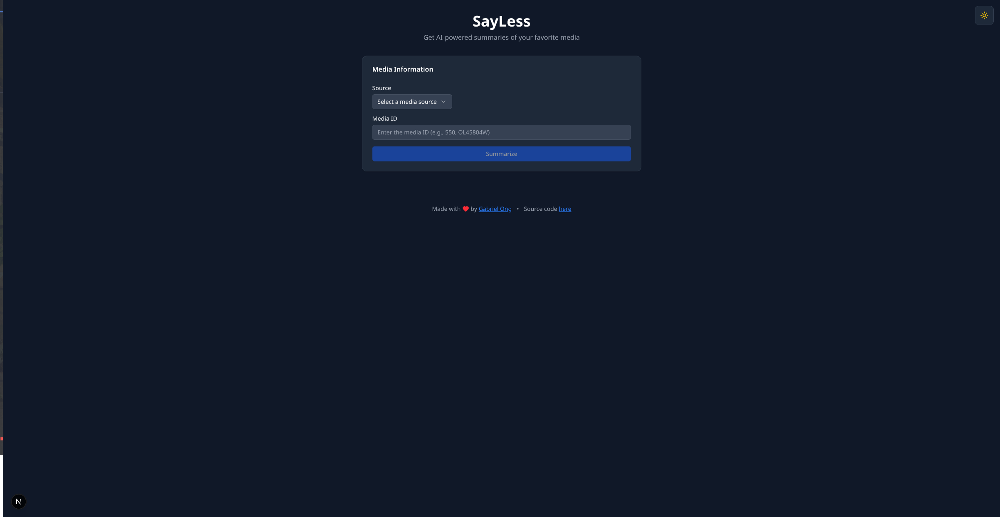
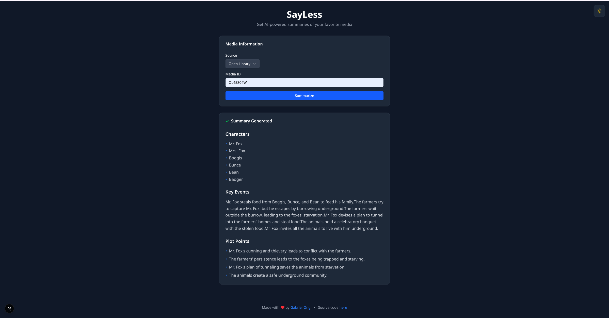
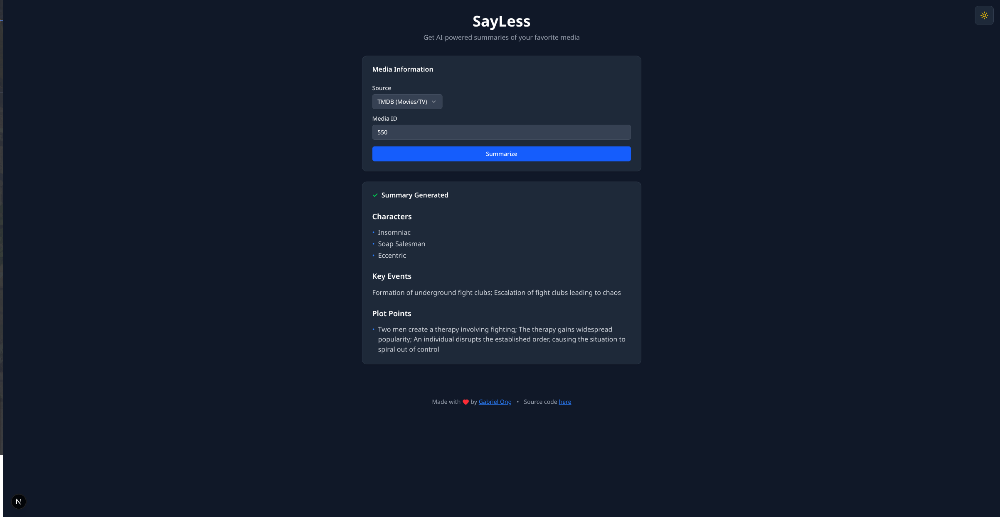
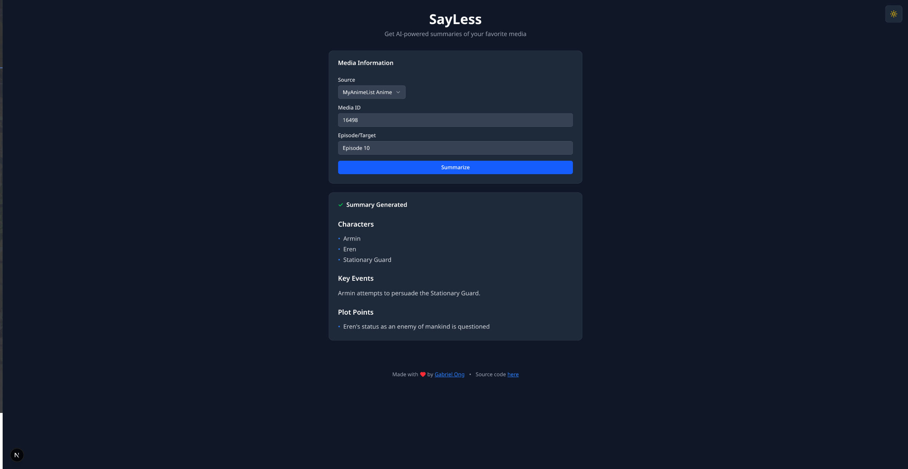
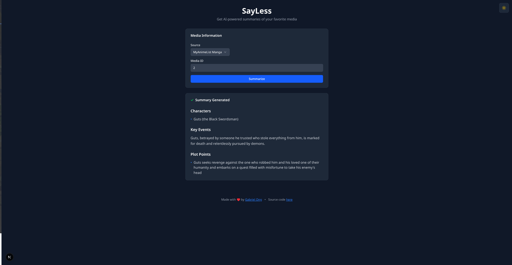

[](https://github.com/gongahkia/sayless/releases/tag/1.0.0) 

## Todo

* furnish README.md

# `SayLess`

... add funny logo here

## Rationale

... Something about spoilers and not wanting to rewatch Rezeero season 2

## Stack

* *Frontend*: [Next.js](https://nextjs.org/), [React](https://react.dev/), [TypeScript](https://www.typescriptlang.org/)
* *Backend*: [Phoenix](https://www.phoenixframework.org/), [Elixir](https://elixir-lang.org/), [Ecto](https://hexdocs.pm/ecto/)
* *API*: [OpenLibrary API](https://openlibrary.org/), [MyAnimeList API](https://myanimelist.net/apiconfig/references/api/v2), [TMDb API](https://developer.themoviedb.org/docs/getting-started)

## Screenshots

### Light Mode, Dark Mode

<div style="display: flex; justify-content: space-between;">
  
  
</div>

### Books (OpenLibrary), Movies (TMDb)

<div style="display: flex; justify-content: space-between;">
  
  
</div>

### MyAnimeList (Anime, Manga)

<div style="display: flex; justify-content: space-between;">
  
  
</div>

## Usage

The below instructions are for locally hosting `SayLess`.

1. First execute the below.

```console
$ git clone https://github.com/gongahkia/sayless && cd sayless
$ chmod +x dev.sh
```

2. Get your [Gemini API key](https://ai.google.dev/gemini-api/docs/api-key) and [TMDb API Key](https://developer.themoviedb.org/reference/intro/getting-started), then create an `.env` file at [backend](./backend).

```env
GEMINI_API_KEY=XXX
TMDB_API_KEY=XXX
```

3. Finally run the below.

```console
$ make
```

## Endpoints

For the exclusive purpose of testing the [Elixir backend](./backend/).

1. First run the below.

```console
$ cd backend && mix phx.server
```

2. Then use `curl` via the following to test POST reqeuests to the [Backend](./backend/).

| Command | Example | Purpose |
| :--- |:--- | :--- |
| | `curl -X POST http://localhost:4000/api/v1/summarize -H "Content-Type: application/json" -d '{"source": "myanimelistanime", "media_id": 16498, "target_name": "Episode 1"}'` | | 
| | `curl -X POST http://localhost:4000/api/v1/summarize -H "Content-Type: application/json" -d '{"source": "myanimelistmanga", "media_id": 2}'` | | 
| |`curl -X POST http://localhost:4000/api/v1/summarize -H "Content-Type: application/json" -d '{"source": "openlibrary", "media_id": "OL45804W"}'` | |
| | `curl -X POST http://localhost:4000/api/v1/summarize -H "Content-Type: application/json" -d '{"source": "themoviedb", "media_id": 550}'` | |

## Architecture


## Other notes

...