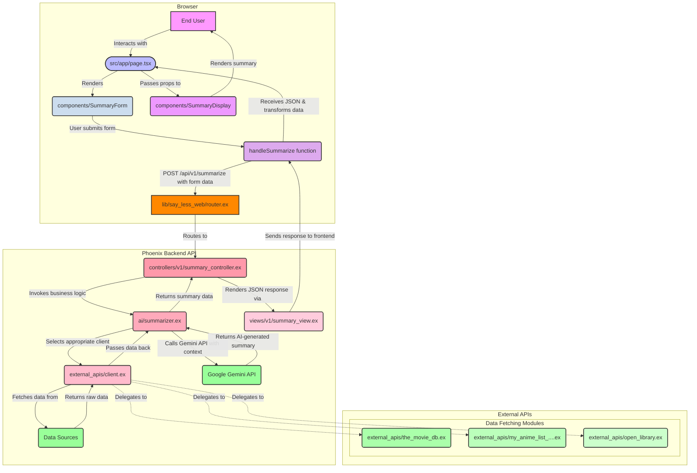

[](https://github.com/gongahkia/sayless/releases/tag/1.0.0) 
[](https://github.com/gongahkia/sayless/releases/tag/2.0.0) 


# `SayLess`

Full Stack Web App that generates [summaries](#endpoints) for [Anime, Manga, Books and Movies](#support).

## Rationale

I watched [Episode 1](https://www.imdb.com/title/tt10112240/?ref_=ttep_ep_1) of [Re:Zero](https://www.imdb.com/title/tt5607616) [Season 2](https://www.imdb.com/title/tt5607616/episodes/?season=2) last week and despised its setting so much I wished I could [go next](https://www.urbandictionary.com/define.php?term=go+next) and just skip Season 2 entirely. 

`SayLess` is (*maybe*) a small step in the right direction.

<div align="center">
  
</div>

## Stack

* *Frontend*: [Next.js](https://nextjs.org/), [React](https://react.dev/), [TypeScript](https://www.typescriptlang.org/), [Tailwind CSS]()
* *Backend*: [Phoenix](https://www.phoenixframework.org/), [Elixir](https://elixir-lang.org/), [Ecto](https://hexdocs.pm/ecto/)
* *API*: [OpenLibrary API](https://openlibrary.org/), [MyAnimeList API](https://myanimelist.net/apiconfig/references/api/v2), [TMDb API](https://developer.themoviedb.org/docs/getting-started), [Gemini 2.0 Flash API](https://ai.google.dev/gemini-api/docs/api-key)

## Screenshots

### Light Mode, Dark Mode

<div style="display: flex; justify-content: space-between;">
  
  
</div>

### Books (OpenLibrary), Movies (TMDb)

<div style="display: flex; justify-content: space-between;">
  
  
</div>

### MyAnimeList (Anime, Manga)

<div style="display: flex; justify-content: space-between;">
  
  
</div>

## Usage

The below instructions are for locally hosting `SayLess`.

1. First execute the below.

```console
$ git clone https://github.com/gongahkia/sayless && cd sayless
$ make setup 
```

2. Get your [Gemini API key](https://ai.google.dev/gemini-api/docs/api-key) and [TMDb API Key](https://developer.themoviedb.org/reference/intro/getting-started), then create an `.env` file at [backend](./backend).

```env
GEMINI_API_KEY=XXX
TMDB_API_KEY=XXX
NEXT_PUBLIC_API_BASE_URL=http://localhost:4000
```

3. Then run the below to spin up `SayLess`' frontend and backend.

```console
$ make
```

4. Optionally run the below additional single-purpose commands.

```console
$ make frontend-test
$ make frontend-build
$ make backend-test
$ make smoke-backend
$ make smoke-api
```

5. Alternatively, run `SayLess`' full stack with Docker to skip local installation of Elixir.

```console
$ make docker-up
```

## Support

`SayLess` currently supports the following mediums.

* **Anime**: Search a series, load episodes, summarize a chosen episode
* **TV**: Search a show, load episodes by season, summarize a chosen episode
* **Movies**: Search a movie, summarize the full title overview
* **Manga**: Search a manga, summarize the full title synopsis
* **Books**: Search a work, summarize the full title description

## Endpoints

For the exclusive purpose of testing the [Elixir backend](./backend/).

1. First run the below.

```console
$ cd backend && mix phx.server
```

2. Then use `curl` via the following to test POST reqeuests to the [Backend](./backend/).

| Media Type | Source | Schema | Example command |
| :--- | :--- | :--- |:--- | 
| Anime | [MyAnimeList](https://myanimelist.net/) | `{"source": "myanimelistanime", "media_id": <SHOWID>, "target_name": "Episode <EP_NUM>"}` | `curl -X POST http://localhost:4000/api/v1/summarize -H "Content-Type: application/json" -d '{"source": "myanimelistanime", "media_id": 16498, "target_name": "Episode 1"}'` |
| Manga | [MyAnimeList](https://myanimelist.net/) | `{"source": "myanimelistmanga", "media_id": <MANGAID>}` | `curl -X POST http://localhost:4000/api/v1/summarize -H "Content-Type: application/json" -d '{"source": "myanimelistmanga", "media_id": 2}'` | 
| Book | [OpenLibrary](https://openlibrary.org/) | `{"source": "openlibrary", "media_id": "<BOOKID>"}` |`curl -X POST http://localhost:4000/api/v1/summarize -H "Content-Type: application/json" -d '{"source": "openlibrary", "media_id": "OL45804W"}'` |
| Movie | [TMDb](https://www.themoviedb.org/) | `{"source": "themoviedb", "media_id": <MOVIEID>}` | `curl -X POST http://localhost:4000/api/v1/summarize -H "Content-Type: application/json" -d '{"source": "themoviedb", "media_id": 550}'` |

## Architecture



## Other notes

[Elixir](https://elixir-lang.org/) is awesome. A pain to learn at first, but awesome.
